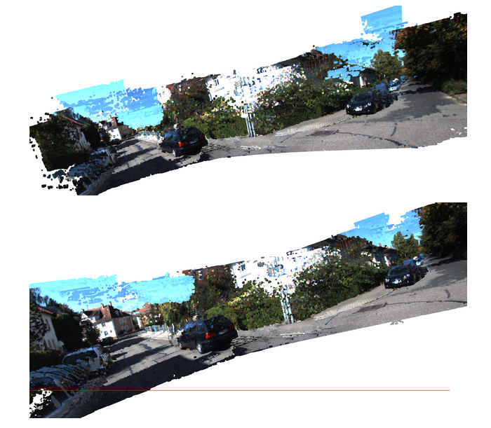

# Stereo-Dense-Reconstruction

### Task
We are given 21 pairs of stereo images with calibration matrix and their Respective ground truth values, and also the baseline values from this data we have to reconstruct a 3d Point cloud representing all the points from the images. 

## Steps to get the Point clouds:
### Get the Disparity Map from stereo image pair.
Math :  
D = x1 - x2  
Where x1 is the location of a point in the left image and x2 is the location of the point in the right Image. 

Code :  
Using the inbuilt function of Open CV, StereoSGBM_create using the tuning parameters of inspired by the blog post : http://timosam.com/python_opencv_depthimage.  
And then using stereo.compute we calculate the disparity values. 

### Get the point cloud for a pair of images:
Math :  
The 3d Point cloud of the images can be obtained by using these disparity values. The formula will be  

Z = (b*f)/(x1-x2)  
X = (Z*x) / f  
Y = (Z * y) / f  

Where:  
b  = baseline parameter provided in the question  
f  = Focal Length obtained from the K matrix 
x = (x1+x2 /2)  
y = (y1+y2 /2)  

Code :  
We do this operation using the Q matrix way, Were the Q matrix as defined in the Slides Q matrix. And Multiplied the Q matrix using Disparity_map with is [x,y,d,1] 

### Register the generated points and into world frame using the given ground truth values (poses.txt)
Math :  
 We have 3d point [w*x,w*y,w*z,w], and using the Projection matrices in ground truth we get the registered 3d point in the point cloud of a single world frame.  

Code:  
For each of the point in the point cloud multiply the point from the respective projection matrix and get and append these points into a single point cloud. And then visualize them.  
    OutPut: 

